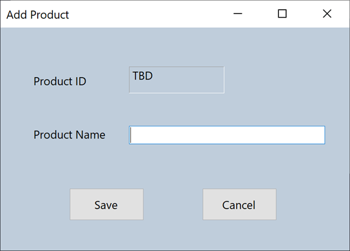
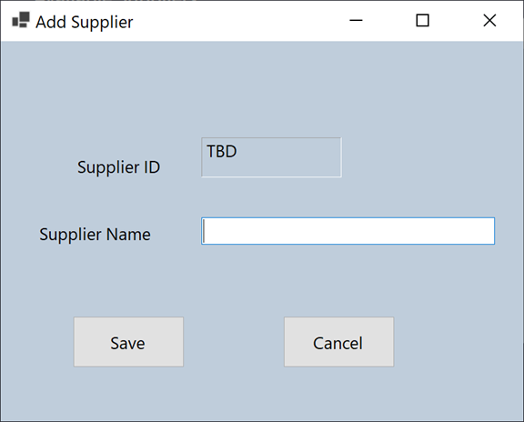

# TRAVEL EXPERT APPLICATION
WORKSHOP 4 – C#.NET

* LANGUAGE: C#.NET
* DATABASE: MSSQL

## TEAM

* **Lina Orozco** 
* **Nansy Salem** 
* **Tamika Taylor** 
* **Yisi Dong** 

Travel Expert Agency Application. 

Travel Experts Application administer the data stored on TravelExperts database.   

The agents can 

* add/edit travel packages  
* add/edit product 
* add/edit suppliers
* add/edit product_suppliers

## Steps Required to Start 

Travel Expert Application connect to TravelExperts Database in MSSQL.

* Run query to create an populate Database (travelexperts-mssql)

</img>

## Application

</img>

### Dashboard

</img>

### Packages

</img>
</img>
</img>

### Products

</img>
</img>

### Suppliers

</img>
</img>

### Product_Suppliers

</img>
</img>

